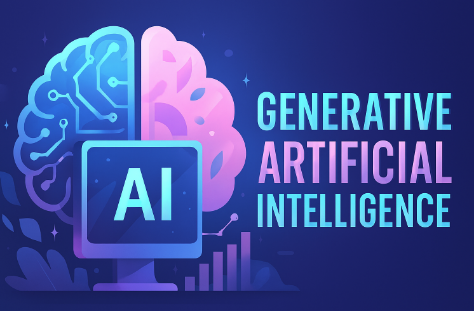
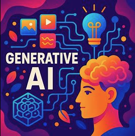
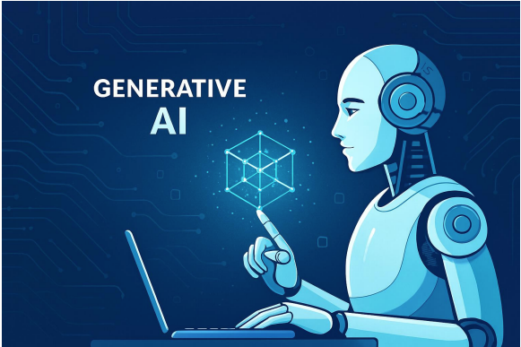

<!DOCTYPE html>
<html lang="es">
<head>
    <meta charset="UTF-8">
    <meta name="viewport" content="width=device-width, initial-scale=1.0">
    <title>Inteligencia Artificial Generativa</title>
    
</head>
<body>
    <header>
        <h1>Inteligencia Artificial Generativa</h1>
        
Explorando el presente y futuro de la IA

    </header>

    <nav>
        <a href="#definicion">Definición</a>
        <a href="#usos">Usos en la vida cotidiana</a>
        <a href="#futuro">Futuro de la IA</a>
    </nav>

    <section id="definicion">
        <h2>Definición</h2>
        

            La inteligencia artificial generativa (IA Generativa) es un campo de la IA que utiliza 
            modelos avanzados para crear contenido nuevo como imágenes, música, texto o incluso 
            simulaciones. Se basa en redes neuronales profundas y algoritmos de aprendizaje automático 
            que aprenden patrones de grandes cantidades de datos.
        

        

            
            
        

    </section>

    <section id="usos">
        <h2>Usos en la vida cotidiana</h2>
        

            La IA generativa se aplica en múltiples áreas de nuestra vida diaria: generación de 
            imágenes artísticas, creación de asistentes virtuales, diseño de moda, producción musical, 
            desarrollo de videojuegos y mucho más.
        

        

            
            
        

    </section>

    <section id="futuro">
        <h2>El futuro de la IA</h2>
        

            En el futuro, la IA generativa tendrá un impacto aún mayor en la innovación, 
            permitiendo avances en medicina, educación personalizada, desarrollo sostenible y 
            creatividad humana. Sin embargo, también plantea retos éticos y de regulación 
            que deben ser cuidadosamente considerados.
        

        

            
        

    </section>

    <footer>
        
© 2025 - Página sobre Inteligencia Artificial Generativa

    </footer>
</body>
</html>
